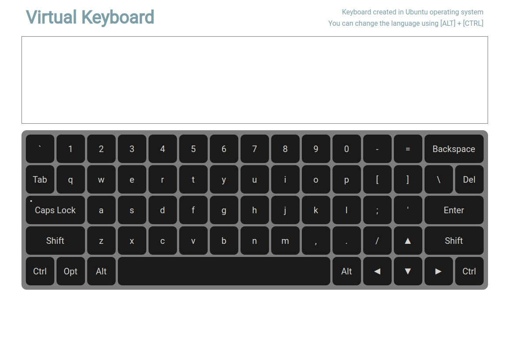

# Virtual Keyboard

App Virtual Keyboard


## Deploy

https://alexpashchuk.github.io/virtual-keyboard/

## Install instructions:

```bash
1. git clone https://github.com/alexpashchuk/virtual-keyboard
2. npm i
3. npm run start
```

### Used technologies

- JavaScript
- CSS
- Webpack

## Screenshot


